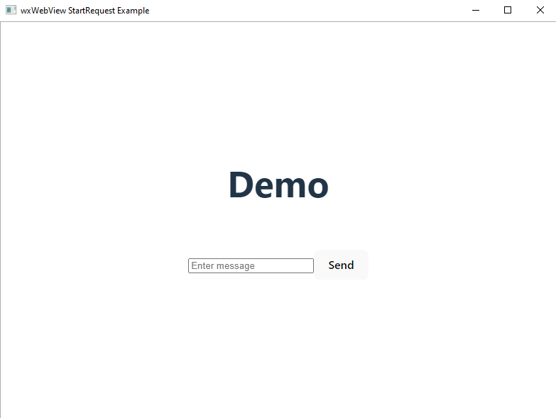
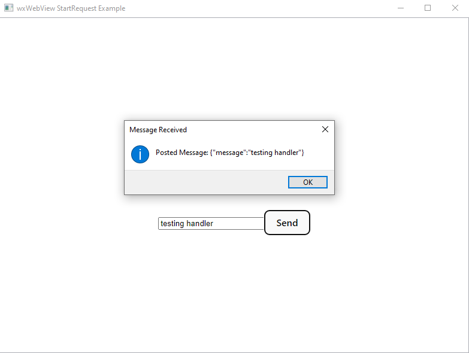

# wxWebViewChromium Example

This is an example project that runs a React app in `wxWebViewChromium` 
to demonstrate how to use `wxWebViewHandler` and `StartRequest`.

## Requirements

+ CMake >= 3.15
+ C++17
+ NodeJS

## Building

The example program can be built using the following commands:

```bash
cmake -S . -B build
cmake --build build
```

This will handle building both the executable and the NodeJS project.

## Screenshots

Here is the ReactJS app rendered in the WebView:



This is a popup message that is created when the wxWebViewHandler receives a POST request:

